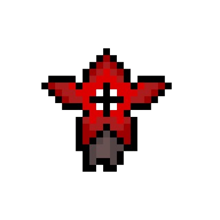
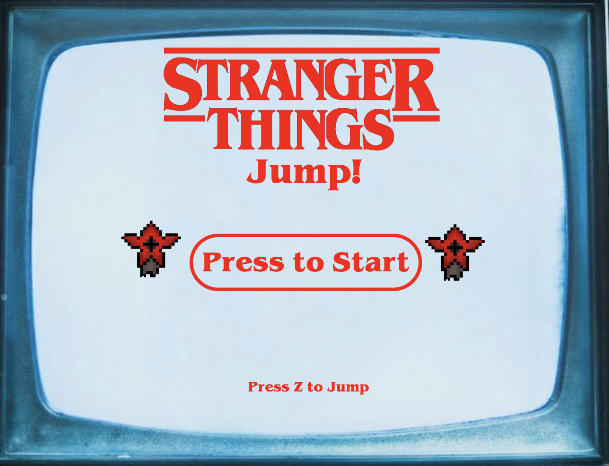

 

<h1 align="center" dir="auto"><strong>Stranger Things Jump!</strong></h1>
<h2 align="center" dir="auto">A game based in the hidden Google Chrome Dinosaur Game and the TV show Stranger Things.</h2>

 
 
<h3><strong>Introduction:</strong></h3>
<ul>
<li><em>The Dinosaur Game</em>, also known as the <em>T-Rex Game</em>, <em>Steve the Jumping Dinosaur</em>, or <em>Dino Runner</em> and initially codenamed <em>Project Bolan</em>, is a built-in browser game in the Google Chrome Web Browser. The game was created by <em>Sebastien Gabriel</em> in 2014, and can be accessed by hitting the space bar when in offline mode on Google Chrome.</li>
<li><em>Stranger Things</em> is an American science fiction horror drama TV show created by the <em>Duffer Brothers</em> that is streaming on <em>Netflix</em>. The brothers serve as showrunners and are executive producers along with <em>Shawn Levy</em> and <em>Dan Cohen</em>. Set in the 1980s primarily in the fictional town of Hawkins, Indiana, the TV show centers around numerous supernatural events occurring around the town, specifically around their connection to a hostile alternate reality called the "Upside Down".</li></ul>
 
<h3><strong>About:</strong></h3>
<ul>
<li>This is the result of my first <em><strong>Ironhack</strong> Web Development</em> course project. The gameplay design is so simple that the user won’t find it difficult to use and understand.</li>
<li>The game has two levels, <em><strong>Hawkins</strong></em> and <em><strong>Upside Down</strong></em>. The idea of the game is to avoid (jump) the <strong>demogorgons</strong> coming at you. You can choose to play in the <strong>Upside Down</strong>, or in the city of <strong>Hawkins</strong>.
</li></ul>
 
<h3><strong>Difficulties:</strong></h3>
<ul><li>The challenges were many, but after 3 intense weeks of studying and with the knowledge acquired in the bootcamp, I managed to develop a simple and objective game. I had a lot of support and help from my colleagues and teachers (thanks a lot <em><strong>André</strong></em> and <em><strong>Xico</strong></em>!) to get it done.</li>
<li>The steps were: benchmark, design concept, user study as I passed it on to many adults and children to test, and of course the code. Developing anything does not depend only on the code, but on several criterias to reach the expected result. I was able to work on a topic I like, and code :-)</li></ul>
 
 
 
<h1 align="center" dir="auto">
<a rel="noopener noreferrer" href="https://lzaquine.github.io/Stranger-Things-Jump-The-Game/" target="_blank"><strong>PLAY NOW!</strong></a></h1>
 
 

 
<h3><strong>Controls:</strong></h3>
<table>
<thead>
<tr style="border: 2px solid grey;">
<th style="border: 2px solid grey;">Key</th>
<th style="border: 2px solid grey;">Action</th>
</tr>
</thead>
<tbody style="border: 2px solid grey;">
<tr style="border: 2px solid grey;">
<td style="border: 2px solid grey;"><strong><code>Z</code></strong></td>
<td style="border: 2px solid grey;">Jump and avoid the demogorgons.</td>
</tr>
</tbody>
</table>
 
 
<h3><strong>To do:</strong></h3>
<ul>
<li>Animate both players.</li>
<li>Make it responsive.</li>
<li>Add more obstacles (demogorgons).</li>
<li>Add score and high score board.</li>
<li>Add jump sound effect.</li>
</ul>
 
 
<h3><strong>References:</strong></h3>
<ul><a rel="noopener noreferrer" href="https://chromedino.com" target="_blank"><li>Chrome Dino</li></a>
<a rel="noopener noreferrer" href="https://www.netflix.com/title/80057281" target="_blank"><li>Stranger Things</li></a></ul>
</a>
